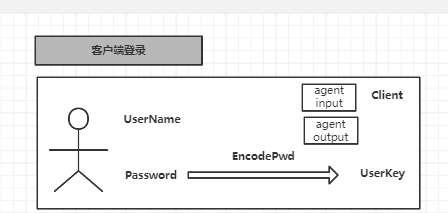
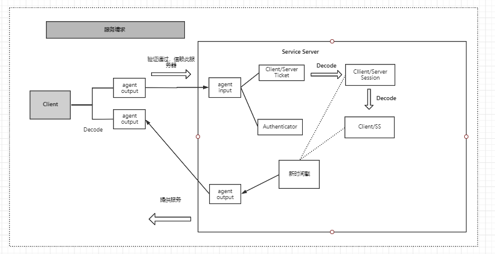

#### Kerberos授权协议
Kerberos 是采样C/S结构,并且能够相互验证的一种网络授权协议,工作在全双工模式下.
可以方式窃听,防止重放攻击,保护数据完整性的场合. 使用对称加密进行密钥管理的系统.

#### 基本描述
Kerberos由两个逻辑部分组成: 认证服务器和票据授权服务器,这两个作为可信的三方.也叫做密钥分发中心KDC.
Kerberos工作在于证明用户身份的票据基础上.

KDC会维护一个密钥数据库. 每个网络实体每个网络实体——无论是客户还是服务器——共享一套只有他自己和KDC知道的密钥.
密钥的内容用于证明实体的身份. 对于两个实体间的通信, KDC产生一个会话密钥, 用来加密他们之间的交互信息.

#### 协议内容
协议的安全主要依赖于参加者对时间的松散同步和短周期的叫做Kerberos票据的认证声明
下面是对这个协议的一个简化描述,将使用以下缩写:

+ AS    认证服务器
+ KDC   密钥分发中心
+ TGT   票据授权票据
+ TGS   票据授权服务器
+ SS    特定服务提供端

1. 客户端用户发送自己的用户名到KDC服务器以向AS服务进行认证。
2. KDC服务器会生成相应的TGT票据, 打上时间戳, 在本地数据库中查找该用户的密码, 并用该密码对TGT进行加密,将结果发还给客户端用户.
3. 客户端收到该信息, 并使用自己的密码进行解密之后, 就能得到TGT票据了(这个TGT会在一段时间之后失效, 也有一些程序(session manager)能在用户登陆期间进行自动更新)
4. 当客户端用户需要使用一些特定服务(Kerberos术语中用"principal"表示)的时候, 该客户端就发送TGT到KDC服务器中的TGS服务。
5. 当该用户的TGT验证通过并且其有权访问所申请的服务时, TGS服务会生成一个该服务所对应的ticket和session key, 并发还给客户端。
6. 客户端将服务请求与该ticket一并发送给相应的服务端即可.

#### 具体流程

> 客户端登录
1. 用户输入用户ID和密码到客户端.
2. 客户端程序运行一个单向函数（大多数为杂凑）把密码转换成密钥，这个就是客户端（用户）的“用户密钥”

> 服务端验证
1. Client向AS发送1条明文消息，申请基于该用户所应享有的服务，例如“用户Sunny想请求服务”。
该AS能够从本地数据库中查询到该申请用户的密码，并通过相同途径转换成相同的“用户密钥”
2. AS检查该用户ID是否在于本地数据库中，如果用户存在则返回2条消息
+ 消息A：Client/TGS会话密钥(Client/TGS Session Key)（该Session Key用在将来Client与TGS的通信（会话）上），通过用户密钥(user's secret key)进行加密
+ 消息B：票据授权票据(TGT)（TGT包括：消息A中的“Client/TGS会话密钥”(Client/TGS Session Key)，用户ID，用户网址，TGT有效期），通过TGS密钥(TGS's secret key)进行加密
3. 一旦Client收到消息A和消息B，Client首先尝试用自己的“用户密钥”(user's secret key)解密消息A，如果用户输入的密码与AS数据库中的密码不符，则不能成功解密消息A。
输入正确的密码并通过随之生成的"user's secret key"才能解密消息A，从而得到“Client/TGS会话密钥”。
注意: 客户端无法解密消息B，因为B是用TGS密钥(TGS's secret key)加密的，其无法在客户端解密

> 服务授权
1. 当client需要申请特定服务时，其向TGS发送以下2条消息：
+ 消息c：即消息B的内容（TGS's secret key加密后的TGT），和想获取的服务的服务ID（注意：不是用户ID）
+ 消息d：认证符(Authenticator)（Authenticator包括：用户ID，时间戳），通过Client/TGS会话密钥(Client/TGS Session Key)进行加密
2. 收到消息c和消息d后，TGS首先检查KDC数据库中是否存在所需的服务，查找到之后，TGS用自己的“TGS密钥”(TGS's secret key)解密消息c中的消息B（也就是TGT），从而得到之前生成的“Client/TGS会话密钥”(Client/TGS Session Key)。TGS再用这个Session Key解密消息d得到包含用户ID和时间戳的Authenticator，并对TGT和Authenticator进行验证，验证通过之后返回2条消息：
消息E：client-server票据(client-to-server ticket)（该ticket包括：Client/SS会话密钥 (Client/Server Session Key），用户ID，用户网址，有效期），通过提供该服务的服务器密钥(service's secret key)进行加密
消息F：Client/SS会话密钥( Client/Server Session Key)（该Session Key用在将来Client与Server Service的通信（会话）上），通过Client/TGS会话密钥(Client/TGS Session Key)进行加密
3. Client收到这些消息后，用“Client/TGS会话密钥”(Client/TGS Session Key)解密消息F，得到“Client/SS会话密钥”(Client/Server Session Key)。（注意：Client不能解密消息E，因为E是用“服务器密钥”(service's secret key)加密的）.

> 服务请求
1. 当获得“Client/SS会话密钥”(Client/Server Session Key)之后，Client就能够使用服务器提供的服务了。Client向指定服务器SS发出2条消息：
消息e：即上一步中的消息E“client-server票据”(client-to-server ticket)，通过服务器密钥(service's secret key)进行加密
消息g：新的Authenticator（包括：用户ID，时间戳），通过Client/SS会话密钥(Client/Server Session Key)进行加密
2. SS用自己的密钥(service's secret key)解密消息e从而得到TGS提供的Client/SS会话密钥(Client/Server Session Key)。再用这个会话密钥解密消息g得到Authenticator，（同TGS一样）对Ticket和Authenticator进行验证，验证通过则返回1条消息（确认函：确证身份真实，乐于提供服务）：
消息H：新时间戳（新时间戳是：Client发送的时间戳加1，v5已经取消这一做法），通过Client/SS会话密钥(Client/Server Session Key)进行加密
3. Client通过Client/SS会话密钥(Client/Server Session Key)解密消息H，得到新时间戳并验证其是否正确。验证通过的话则客户端可以信赖服务器，并向服务器（SS）发送服务请求。
4. 服务器（SS）向客户端提供相应的服务。

#### SASL